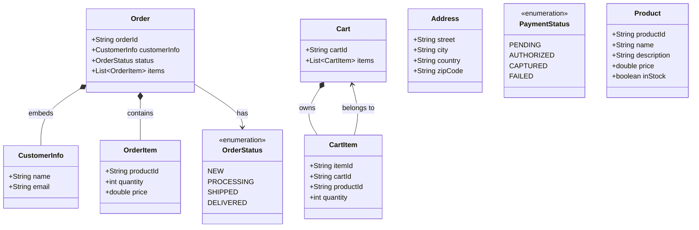

### Test schema

```mermaid
classDiagram
    class Order {
        +String orderId
        +CustomerInfo customerInfo
        +OrderStatus status
        +List~OrderItem~ items
    }

    class CustomerInfo {
        +String name
        +String email
    }

    class OrderItem {
        +String productId
        +int quantity
        +double price
    }

    class OrderStatus {
        <<enumeration>>
        NEW
        PROCESSING
        SHIPPED
        DELIVERED
    }

    class Cart {
        +String cartId
        +List~CartItem~ items
    }

    class CartItem {
        +String itemId
        +String cartId
        +String productId
        +int quantity
    }

    class Address {
        +String street
        +String city
        +String country
        +String zipCode
    }

    class PaymentStatus {
        <<enumeration>>
        PENDING
        AUTHORIZED
        CAPTURED
        FAILED
    }

    class Product {
        +String productId
        +String name
        +String description
        +double price
        +boolean inStock
    }

    Order *-- CustomerInfo : embeds
    Order *-- OrderItem : contains
    Order --> OrderStatus : has
    Cart *-- CartItem : owns
    CartItem --> Cart : belongs to
```
